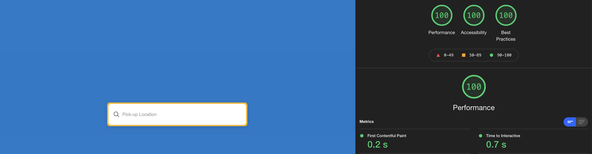

<h1>Search Box app</h1>

## Table of Contents

- [About](#about)
  - [Built With](#built-with)
- [Installation](#installation)
  - [Available scripts](#available-scripts)
- [Usage](#usage)
- [Development](#development)
  - [Testing](#testing)
  - [Client-Side Performance](#client-side-performance)
  - [Performance Testing](#performance-testing)
  - [Accessibility](#accessibility)

## About

Replica of the Rentalcars.com Search Box.

### Built with

The following tools and libraries were used

[](https://reactjs.org/) [](https://sass-lang.com/) [](https://testing-library.com/) [](https://jestjs.io/) [](https://axios-http.com/docs/intro) [](https://eslint.org/) [](https://www.typescriptlang.org/) [](https://www.npmjs.com/package/jest-axe)

### Installation

To run the project locally you need to clone the repository and then run the rest of the commands.

```sh
git clone https://github.com/Niko-7/search-box-tech-test
cd search-box-app
npm install
npm run start
```

### Available scripts

Build the app locally

```
npm run build
```

Start app on localhost

```
npm run start
```

Test with coverage report

```
npm run test
```

### Usage

Replica of the Rentalcars location search box

When entering a single alphanumeric character into the "Pick-up Location" input, the placeholder text disappears, and no search results are displayed.

When entering 2 or more alphanumeric characters into the "Pick-up Location" input, then a list of up to 6 results gets displayed.

When entering a search term in the "Pick-up Location" input that is not recognised e.g. "asdf1234", then a "No results found" message gets displayed.

When truncating the search term leaving only 1 character, then the search results list is no longer displayed.

### Development

This project was developed using [React](https://reactjs.org/). The overall experience of development with using React and it's reusable UI components is better and faster and offer a more stable code.

[Typescript](https://www.typescriptlang.org/) was used for offering a better readability and maintainability to the project.

Styling took place with the help of [Sass](https://sass-lang.com/) in order to make the Search Box look like its live version.

---

#### Testing

Through the development of this project, TDD was applied to every step. Unit tests using Jest and React Testing Library were written to ensure the components behavior and states. Additionally custom hooks were also tested in order to make sure that each usage scenario would still work as expected. Snapshot tests were also added.

---

#### Client-Side Performance

React Hooks were used in order to update state in the input field. When a user enters a location in the input box, the **useEffect** hook has been enhanced with a 500ms timer which only takes the value that will exist at the end of that timer, and will then make an [Axios](https://axios-http.com/docs/intro) request with that value.

---

#### Performance Testing

[Lighthouse audits](https://developers.google.com/web/tools/lighthouse) were run in order to access the quality of the app's performance, accessibility, SEO and more.

<div>
   
</div>

---

#### Accessibility

[Jest-Axe](https://www.npmjs.com/package/jest-axe) and [Google Chrome Screen Reader](https://chrome.google.com/webstore/detail/chromevox-classic-extensi/kgejglhpjiefppelpmljglcjbhoiplfn?hl=en) was used to test the accessibility levels of this app.

---
